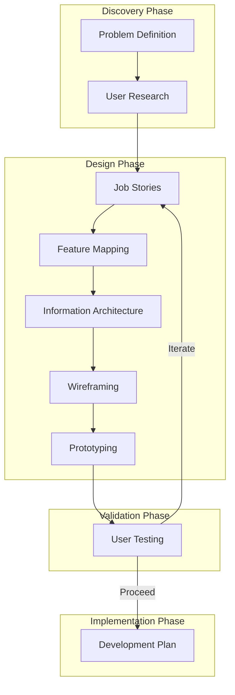

# Kronos Architecture Overview
## Feature Development Process
1. **Problem Definition**
   - Clear problem statement
   - Success criteria
   - Constraints

2. **User Research**
   - Use cases
   - User pain points
   - Market analysis

3. **Job Stories**
   - User scenarios
   - When/I want to/So that format
   - Priority mapping

4. **Feature Mapping**
   - Core functionality
   - Nice-to-haves
   - Technical requirements

5. **Information Architecture**
   - Data structure
   - User flows
   - System interactions

6. **Wireframing**
   - UI layouts
   - Interaction points
   - Component hierarchy

7. **Prototyping**
   - Implementation approach
   - Technical spikes
   - MVP definition

8. **User Testing**
   - Validation methods
   - Success metrics
   - Feedback loops

9. **Development Plan**
   - Implementation steps
   - Resource allocation
   - Timeline

## Core Components

### Frontend (SolidJS)
- Rich text editor (Lexical)
- File system integration
- State management
- Routing
- UI components

### Backend (Tauri)
- File system operations
- Store management
- System integration
- Security

## Key Features

### Note Management
- Markdown-based storage
- YAML frontmatter for metadata
- Local file system integration
- Kronosphere (vault) system

### Journal System
- Daily notes
- Weekly notes
- Calendar integration
- Automatic file naming

### Data Structure
- Plain text files
- Directory-based organization
- Metadata in frontmatter
- Tag-based organization

## Design Principles
1. Local-first
2. Zero-friction
3. Plain text
4. Fast and reliable
5. Simple > Complex
